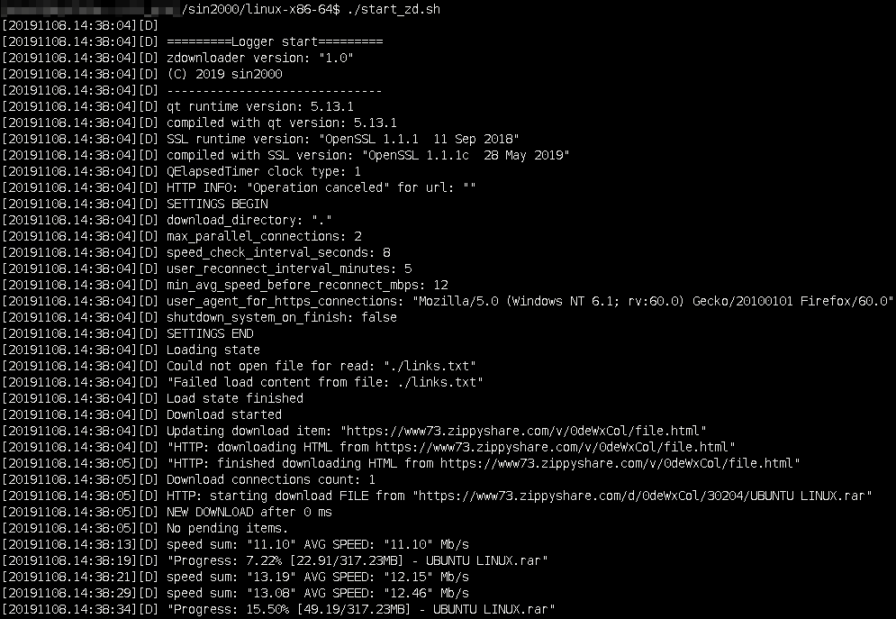

## Changelog
- 2020-04-24 v2.0 - [LINK](CHANGELOG.md)
- 2020-04-08 v1.9 - [LINK](CHANGELOG.md)

# zdownloader
Zdownloader is a lightweight download manager running from command line.  
Zdownloader was written in C++ and supports downloading files by HTTPS from services such as:
- ZippyShare,
- Google Drive,
- MegaUp(megaup.net).



## Features
- Can download multiple files at a time.
- Supports segmented downloading.
- It can resume interrupted downloads.
- Can check multiple links at a time.
- It can reconnect after specific time if download speed is too low.
- It can unpack archive files after download. Supports: rar, 7z and zip.
- Supports network proxies.
- Allows you to download google drive files even if the daily limit of download has exceeded using google drive REST API v3.

## Requirements
#### Linux x86-64  
`ldd zdownloader`:
- linux-vdso.so.1
- libbotan-2.so.13
- libQt5Network.so.5 
- libQt5Core.so.5
- libQt5Script.so.5
- libpthread.so.0
- libstdc++.so.6
- libgcc_s.so.1
- libc.so.6
- libz.so.1
- libdl.so.2
- libm.so.6
- /lib64/ld-linux-x86-64.so.2

#### General
- Linux kernel >= 3.2.0
- glibc(libc6) >= 2.25
- OpenSSL >= 1.1.0
- Qt5 >= 5.13.0  
I have attached precompiled Qt libs in lib directories (license: GNU LGPL version 3, Qt source code: https://code.qt.io)
- Botan >= 2.14 - needed for JWT sign in gdrive api  
I have attached precompiled Botan library in lib directory (https://botan.randombit.net)
- for unpack rar files: unrar >= 5.50
- for unpack 7z, zip files: 7z >= 16.02

#### Windows
- you probably need Visual C++ 2017 redistributables x64: https://aka.ms/vs/16/release/vc_redist.x64.exe
- I have attached precompiled Qt libs in win7_8_10-x64 directory. License: GNU LGPL version 3, Qt source code: https://code.qt.io.
- I have attached precompiled OpenSSL libs in win7_8_10-x64 directory - https://www.openssl.org
- for unpack rar files: WinRar >= 5.50 - https://www.rarlab.com/download.htm
- for unpack 7z, zip files: 7-zip >= 16.02 - https://www.7-zip.org/download.html

## Usage
**links.txt** file:
- create links.txt file in zdownloader directory,
- you can add URLs to links.txt file: one line -> one URL,
- at the beginning zdownloader checks and sorts the links,
- checked and sorted links are saved to download_list.txt file,
- you can add '--' chars to append links as one group,
- you can add encoded links,
- you can put line comments - just add hash(#) character before comment.
- from zdownloader v2.0 you can use(in links.txt file) any of these gdrive link formats (and similar):  
https://drive.google.com/file/d/0B1MVW1mFO2zmZHVRWEQ3Rkc3SVE  
https://drive.google.com/file/d/0B1MVW1mFO2zmZHVRWEQ3Rkc3SVE/view  
https://drive.google.com/uc?id=0B1MVW1mFO2zmZHVRWEQ3Rkc3SVE  
https://drive.google.com/uc?id=0B1MVW1mFO2zmZHVRWEQ3Rkc3SVE&export=download

### Example of links.txt file:
```
# this is comment
https://www73.zippyshare.com/v/0deWxCol/file.html
https%3A%2F%2Fwww73.zippyshare.com%2Fv%2F0deWxCol%2Ffile.html
--
https://drive.google.com/file/d/2M4RhNINIETzt-a6tbkdwLTBS9CAqM-WD
--
https://megaup.net/3Pwaa/something.rar #comment: example link
```

### download_list.txt file:
- download_list.txt file is created after links checks,
- download list has format:
```
file_name URL group_id file_size
```
Four fields separated by tab character.  
Group_id contains group number - is used for unpack archives.  
- You can edit(eg. change order) download_list.txt when zdownloader is not running,
- If remote file does not exists then zdownloader skips that file.

### finished_downloads_\*.txt files:
- contains timestamp, download status, file name and URL,
- download_status can be:  
F (download finished with success),  
X (skipped download, file already exists on disk),  
R (skipped download, remote file does not exists)

### How gdrive download limit bypass works?
- Zdownloader can download google drive files even if the daily limit of download has exceeded. For that zdownloader can use google drive REST API v3.
- Before you start see how to enable and create service account: [LINK](HOWTO_gdrive_service_account.md)
1. The Google Drive API provides an option for 3rd party applications to store their own data on Google Drive, but sandboxed from the user's main file storage area. Hence zdownloader cannot read, modify or delete your Google Drive data. A user's space allocation (default 15GB) is shared between all applications that store data in their Google Account - Drive, Gmail, Google Photos and 3rd party apps like zdownloader.
2. At first step zdownloader list all files on gdrive.
3. Next zdownloader deletes all found files.
4. At last step the application copies the file to your gdrive and download it. 

When using gdrive api you can download one gdrive file at a time(but you can use many segments and other services like zippyshare).


### Unpack
Default value for unrar_binary setting:  
- Linux: `unrar`, Windows: `C:\Program Files\WinRAR\UnRar.exe`

Default value for 7z_binary setting:  
- Linux: `7z`, Windows: `C:\Program Files\7-zip\7z.exe`

Executing parameters:
- rar: `unrar x -parchive_pwd -ai -y -c- -o+ archive_filename archive_dir/`
- 7z: `7z x -parchive_pwd -aoa -y -oarchive_dir/ archive_filename`  
where `archive_dir` is file name without extension.

While the unpack is running, `unpack_queue.txt` file is created in the current directory.

### Start and stop
You can run zdownloader by  
`./start_zd.sh`  
from zdownloader directory.

To stop zdownloader press Ctrl-C or send SIGINT or SIGTERM signal.

#### Settings are stored in zdownloader.ini file:
```ini
; UTF-8 encoding

[Common]
; download_directory
; if directory contains spaces then enclose it in quotation marks
; set empty or '.' for current directory
; on Windows use slash or double backslash as dir separators
download_directory=/media/downloads
user_agent_for_https_connections="Mozilla/5.0 (Windows NT 6.1; rv:60.0) Gecko/20100101 Firefox/60.0"
; shutdown_system_on_finish
; uses 'sudo shutdown --no-wall -P +2' command on Linux or 'shutdown /s /t 120' command on Windows
shutdown_system_on_finish=false
; max_seconds_before_reset_inactive_connection
; integer value
max_seconds_before_reset_inactive_connection=45
; download_lists_directory
; program will read file 'download_list.txt' from download_lists_directory
; program will save file 'finished_downloads_*.txt' in download_lists_directory
download_lists_directory=
; links_file_directory
; program will read file 'links.txt' from links_file_directory
links_file_directory=

[LinkChecker]
max_parallel_link_checks=5
; max_seconds_before_check_link_again_on_error
; integer value
max_seconds_before_check_link_again_on_error=10

[Downloader]
max_parallel_file_downloads=1
max_segments_per_file=2
; min_segment_size_mb
; integer value. Do not change min_segment_size_mb when you have unfinished downloads
min_segment_size_mb=3
; segment_network_read_buffer_kb
; integer value. Download read buffer(in RAM) size per one segment in KBytes.
; Application will try to stop reading from the network once this buffer is full, thus causing the download to throttle down as well.
; This can happen when your system is not capable to download with full speed.
segment_network_read_buffer_kb=2048
; segment_file_write_buffer_kb
; integer value. File write buffer(in RAM) size for one segment in KBytes.
segment_file_write_buffer_kb=1024
; min_seconds_before_next_download, max_seconds_before_next_download, next_download_increase_step_msecs
; next_download_increase_reset_after_seconds
; integer values. Applies to per file download (not per segment)
min_seconds_before_next_download=0
max_seconds_before_next_download=7
next_download_increase_step_msecs=250
; next_download_increase_reset_after_seconds
; integer value. Resets next file download delay to 0 seconds after X seconds
next_download_increase_reset_after_seconds=8
; progress_check_interval_seconds
; integer value. Show 'Progress:...' message every X seconds
progress_check_interval_seconds=10
; speed_check_interval_seconds
; integer value. Show actual speed and average speed every X seconds
speed_check_interval_seconds=8
; user_reconnect_interval_minutes
; integer value. Reconnects all connections every X minutes if avg speed is less than min_avg_speed_before_reconnect_mbps
user_reconnect_interval_minutes=4
; min_avg_speed_before_reconnect_mbps
; integer value
min_avg_speed_before_reconnect_mbps=13

[OutputMessages]
; log_to_file_enabled
; enable or disable applog_*.log files. Applog contains all output messages.
log_to_file_enabled=true
log_directory=
; timestamp_format
; format details: https://doc.qt.io/archives/qt-5.13/qdatetime.html#toString
timestamp_format="yyyyMMdd.hh:mm:ss"
; log_max_rotate_kb
; integer value in KBytes
log_max_rotate_kb=4096
log_max_archive_files=3

[FinishedDownloads]
; log_to_file_enabled
; enable or disable log finished items to finished_downloads_*.txt files.
log_to_file_enabled=true
; timestamp_format
; format details: https://doc.qt.io/archives/qt-5.13/qdatetime.html#toString
timestamp_format="yyyyMMdd.hh:mm:ss"
; log_max_rotate_kb
; integer value in KBytes
log_max_rotate_kb=4096
log_max_archive_files=3

[Unpack]
; unpack_after_download
; enable/disable unpack archive files after download all item in group
unpack_after_download=true
; pause_download_before_unpack
pause_download_before_unpack=false
; delete_archive_files_after_unpack
; true - remove archive files after successful unpack
delete_archive_files_after_unpack=true
; unrar_binary
; path to unrar/rar binary, eg. "/usr/bin/unrar". Leave empty for default value.
unrar_binary=
; 7z_binary
; path to 7zip binary, eg. "/usr/bin/7z". Leave empty for default value.
7z_binary=

[UnpackPasswords]
; set passwords for unpack - update size if you add/remove password
; you can set passwords here even if archive file is not locked by password
1\pass=mypass
;2\pass=mypass2
;3\pass=mypass3
size=1

[UnpackLog]
; log_to_file_enabled
; enable or disable log unpack messages to unpacklog_*.txt files.
log_to_file_enabled=true
; log_directory
; program will save 'unpacklog_*.txt' files in download_lists_directory
; if directory contains spaces then enclose it in quotation marks
; set empty or '.' for current directory
; on Windows use slash or double backslash as dir separators
log_directory=
; timestamp_format
; format details: https://doc.qt.io/archives/qt-5.13/qdatetime.html#toString
timestamp_format="yyyyMMdd.hh:mm:ss"
; log_max_rotate_kb
; integer value in KBytes
log_max_rotate_kb=512
log_max_archive_files=2

[NetworkProxy]
; enable_network_proxy
; set true if you want forward all network activity through proxy server
enable_network_proxy=false
; proxy_type
; available values: socks5 or http. Note: http proxy must support SSL.
proxy_type=socks5
; hostname
; you can set either IP address or hostname
hostname=127.0.0.1
; port
; integer value
port=8889
; username/password authentication
username=
password=

[GDrive]
; use_gdrive_api
; set use_gdrive_api=true to bypass gdrive download limit
; requirements: google account, enabled gdrive api, google service account
use_gdrive_api=false
; google_service_account_json_file
; path to json file with google service account credentials,
; most important fields in json file: client_email and private_key
google_service_account_json_file=./gdrive.json
```

Zdownloader can power off system on download finish. For that zdownloader uses  
- for Linux: `sudo shutdown --no-wall -P +2` command which should execute without any passwords,
- for Windows: `shutdown /s /t 120` command.

#### applog_\*.log files:
Zdownloader can save everything from standard output to rotated log files:  
`applog_1.log ...`

## All contributions are welcome
#### Help and contributions can be any of the following:
- star the project
- new feature or bug fixing via a pull requests
- report issues to the project issues page
- other ideas

##### If you like this project please give it a star ⭐. Thanks!

## Download:
- for Linux x86-64: [DOWNLOAD](https://github.com/sin2000/zdownloader/releases/download/2.0/linux-x86-64.zip)
- for Linux ARM gnueabihf (eg. Raspberry Pi >= 3): [DOWNLOAD](https://github.com/sin2000/zdownloader/releases/download/2.0/arm-linux-gnueabihf.zip)
- for Linux ARM aarch64 (eg. Odroid C2): [DOWNLOAD](https://github.com/sin2000/zdownloader/releases/download/2.0/aarch64-linux-gnu.zip)
- for Windows 7, 8, 10 x64: [DOWNLOAD](https://github.com/sin2000/zdownloader/releases/download/2.0/win7_8_10-x64.zip)
- for Windows 7, 8, 10 x86(32bit): [DOWNLOAD](https://github.com/sin2000/zdownloader/releases/download/2.0/win7_8_10-x86.zip)
